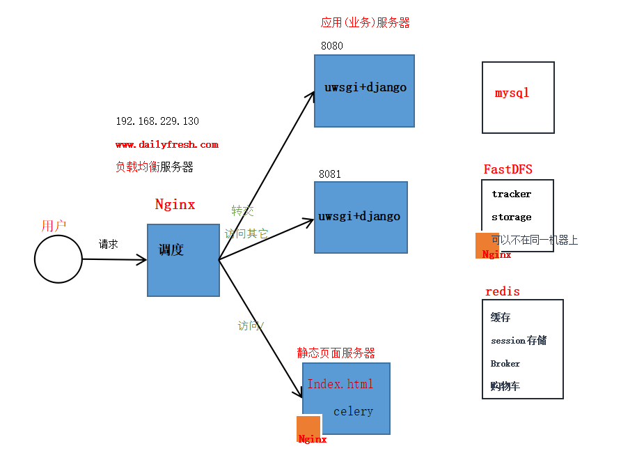
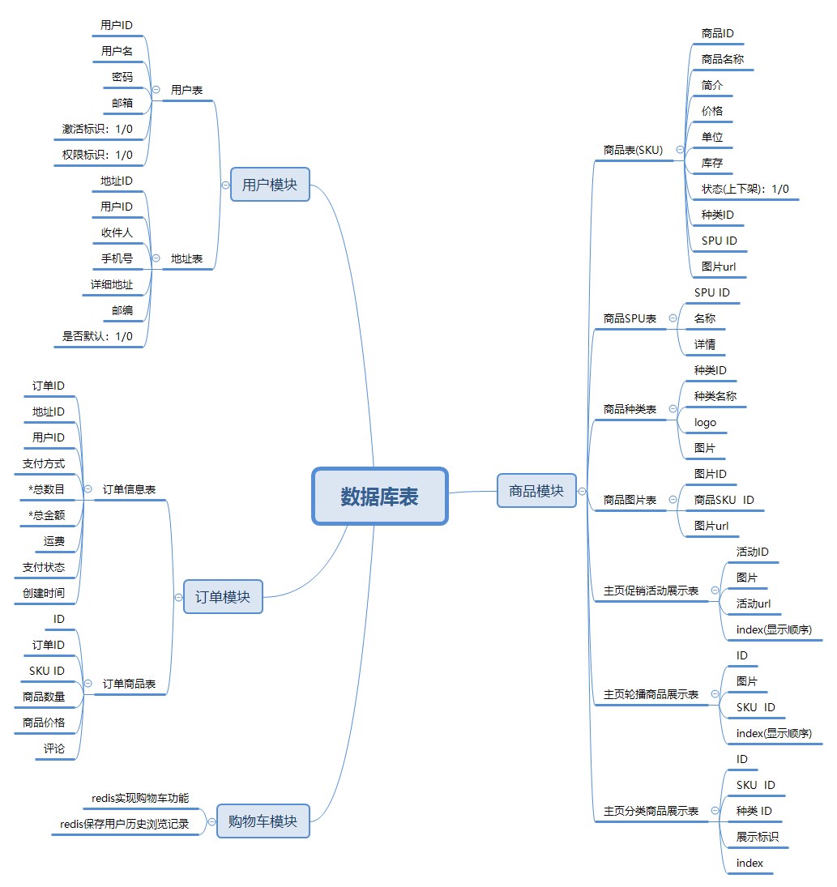

# dailyfresh-B2C
dailyfresh mall based on B2C model  
基于B2C的天天生鲜商城  
> B2C(Business-to-Customer), 企业对个人的一种商业模式，简称"商对客". 商对客是电子商务的一种模式，这种电子商务一般以网络零售业为主，主要借助于互联网开展在线销售活动。 B2C即企业通过互联网为消费者提供一个新型的购物环境——网上商店，消费者通过网络在网上购物、网上支付等消费行为。

为消费者提供一个新型的购物环境:   
从0开始，立项、构建、开发到部署, 搭建一个天天生鲜商场

#### 技术栈
- 语言：Python3.* (Django)   
- 数据库: MySql、 redis  
- 任务队列(异步处理): celery(django-celery)     
- 分布式文件存储: FastDFS   
- 搜索引擎(商品检索)：  haystack(django-haystack)、whoosh、二次开发    
- web服务器配置: Nginx+ uwsgi    
- 开发环境： PyCharm、Linux、vim   

#### 技术架构
* 开发架构    
采用BS结构, 即Browser/Server(浏览器/服务器)结构,构建一个web的网站商城系统, 其架构逻辑:   

* 部署架构     
Nginx+uwsgi     

####  主体模块  
主要分为四个大模块:    
* 用户模块、    
* 商品相关模块、    
* 购物车相关模块、   
* 订单相关模块、    
[查看各模块详情分析](Readme/Analysis.md)

####  数据库表

* SPU是商品信息聚合的最小单位，是一组可复用、易检索的标准化信息的集合，该集合描述了一个产品的特性。通俗点讲，属性值、特性相同的商品就可以称为一个SPU。     
例如，iphone4就是一个SPU，N97也是一个SPU，这个与商家无关，与颜色、款式、套餐也无关。
* SKU即库存进出计量的单位， 可以是以件、盒、托盘等为单位，在服装、鞋类商品中使用最多最普遍。   
例如纺织品中一个SKU通常表示：规格、颜色、款式。        
    
    
#### 功能模块展示      
[点击查看--多图预警](Readme/show.md)
    
   
#### 功能与性能优化
1. 用户注册发激活邮件时，可能发送邮件所需的时间较长，客户端会需要等待，用户体验不好。     
 >  改进: 把耗时的任务放到后台异步执行，此处使用celery任务队列, 其中使用redis作中间件。  
2. redis存储用户历史浏览记录, 采用list数据结构: History_用户id: [skuid1,skuid2,skuid3]
3. 使用redis存储用户购物车商品信息，采用hash数据结构: cart_userid: {'sku_id1': num, 'sku_id2': num}    
4. 采用分布式文件系统， 把商品图片等信息存储在FastDFS系统中, Nginx+FastDFS配合, 减少服务器的压力。         
5. 页面静态化： 首页、商品列表页、商品详情页等用户共同的页面, 把页面静态化，以减少对数据库的操作。当后台数据更改时自动重新生成静态页。  
6. 页面数据缓存，把页面使用的数据存放在缓存中，当再次使用这些数据时，先从缓存中获取，如获取不到，再去查询数据库，减少数据库的查询次数。  
7. 订单并发

### Links      
* Libfastcommon: 安装FastDFS之前要先安装它的依赖库libfastcommon    
[https://github.com/happyfish100/libfastcommon/releases](https://github.com/happyfish100/libfastcommon/releases)   
* FastDFS   
[https://github.com/happyfish100/FastDFS](https://github.com/happyfish100/FastDFS)
* Nginx    
[https://nginx.org/download/](https://nginx.org/download/)    
* fastdfs-nginx-module   
[https://github.com/happyfish100/fastdfs-nginx-module/releases](https://github.com/happyfish100/fastdfs-nginx-module/releases)   
* 支付宝api    
[https://open.alipay.com/platform/home.htm](https://open.alipay.com/platform/home.htm)    
* celery   
[http://docs.jinkan.org/docs/celery/](http://docs.jinkan.org/docs/celery/)   

