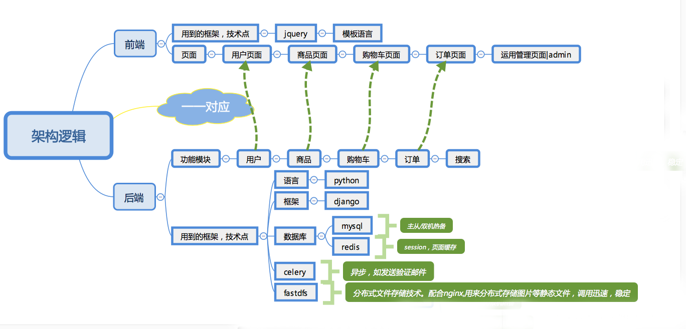

# dailyfresh-B2C
dailyfresh mall based on B2C model  
基于B2C的天天生鲜商城  
> B2C(Business-to-Customer), 企业对个人的一种商业模式，简称"商对客". 商对客是电子商务的一种模式，这种电子商务一般以网络零售业为主，主要借助于互联网开展在线销售活动。 B2C即企业通过互联网为消费者提供一个新型的购物环境——网上商店，消费者通过网络在网上购物、网上支付等消费行为。

为消费者提供一个新型的购物环境:   
从0开始，立项、构建、开发到部署, 搭建一个天天生鲜商场

#### 技术架构
* 开发架构    
项目采用BS结构, 即Browser/Server(浏览器/服务器)结构,构建一个web的网站商城系统, 其架构逻辑:   

* 部署架构

#### 技术栈
- 语言：Python3.* (Django)
- 数据库: MySql、 redis
- 分布式文件存储: FastDFS
- 搜索引擎：     
- web服务器: Nginx+ uwsgi    

####  开发环境

####  主体模块

####  数据库表

#### 功能模块展示

